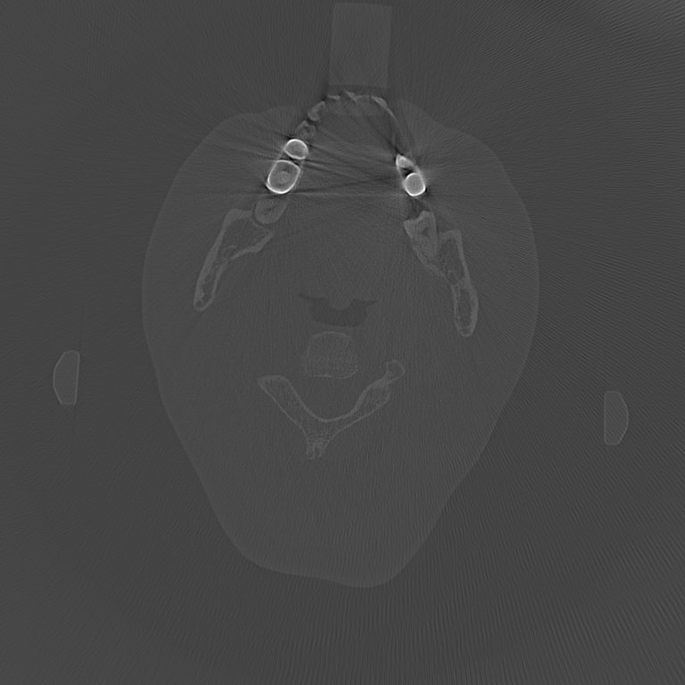

# L0SmoothingGPU-MAR
## What is this project about?
This project tries to reduce the metal artifact of CBCT-reconstruction images utilizing L0-smoothing algorithm. The whole project is the CUDA implementation of the algorithm presented by paper: http://www.cse.cuhk.edu.hk/~leojia/papers/L0smooth_Siggraph_Asia2011.pdf , within the context of CT medical imaging applications.

## How to try it out?
The entire project has been developed on Visual Studio, leveraging NVIDIA GPUs through CUDA. Therefore, all you need are:
1. Windows 10/11
2. Visual Studio 2019
3. CUDA 11.3 or above

Clone this repository and simply open the .vcxproj file and build the whole project in VS.

## A sample of CBCT imaging
### What is CBCT?
CBCT (Cone-Beam Computed Tomography) reconstruction is a process that creates tomographic images from X-ray projection data. 
### What is MAR in the repo name for?
Metal artifact is one of the artifacts commonly encountered in clinical CT imaging and may obscure pathology. There have been various methods proposed to ruduce metal artifacts in CT imaging. This project is exactly an another try on MAR (Metal Artifact Reduction). 
### How does L0SmoothingGPU work on MAR?
L0SmoothingGPU takes a single/multi-slice raw data of a CBCT image as a input and outputs the raw data after reducing metal artifacts.  

   
